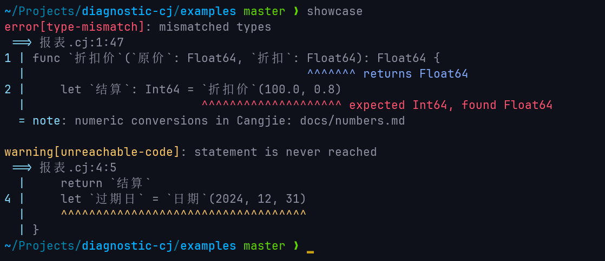

# diagnostic

Friendly, precise diagnostics for Cangjie compilers and tools.



Good error messages are the part of a tool its users see most. diagnostic
renders each `Diagnostic` as a source frame with carets under the offending
code, a compact log line, or an LSP notification — whichever channel it is
headed for.

## Quick start

```cangjie
import diagnostic.*

let diag = Diagnostic(
    range: Some(DiagnosticRange(startLine: 3, startColumn: 2, endLine: 3, endColumn: 6)),
    filename: "src/main.cj",
    severity: DiagnosticSeverity.Error,
    code: "missing-return",
    source: "diagnostic",
    message: "missing return statement"
)

let face = CLIDiagnosticFace()
println(renderToString([diag], face, None))
```

## Documentation

- [API reference](docs/api/index.md) — declarations of every public type and function
- [Design notes](docs/DESIGN.md) — why the library behaves the way it does

## Inspired by

This project draws on the design of
[rustc's diagnostics](https://github.com/rust-lang/rustc-dev-guide/tree/main/src/diagnostics)
and [codespan](https://github.com/brendanzab/codespan).

The terminal display-width model (CJK double-width, zero-width combining
marks) mirrors the character-width table in the Cangjie standard library's
`std.unittest` module (`common/unicode.cj`), which is itself based on
[Markus Kuhn's wcwidth implementation](https://www.cl.cam.ac.uk/~mgk25/ucs/wcwidth.c).
